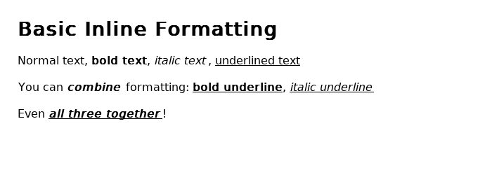
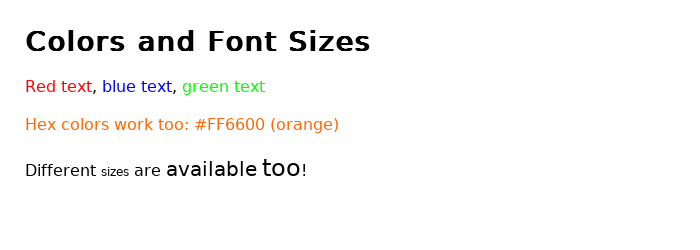
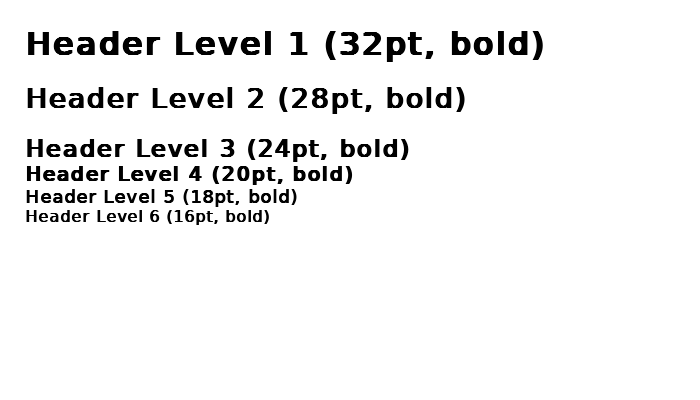
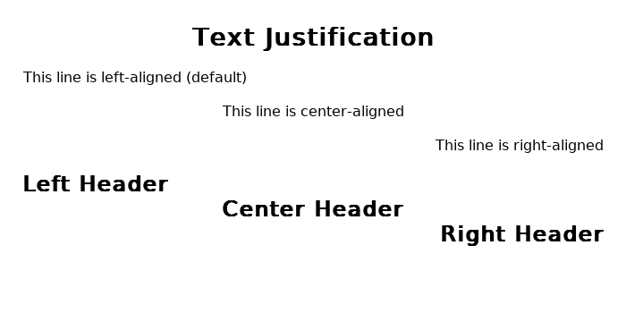
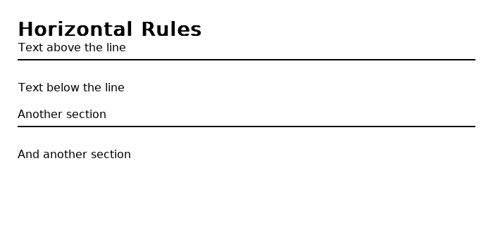
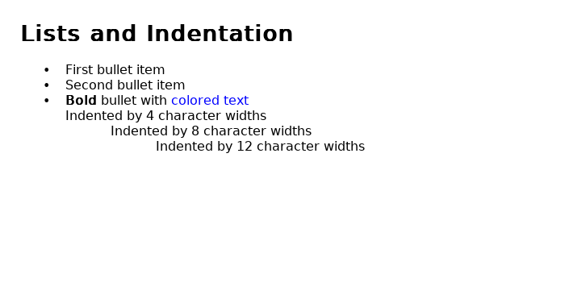
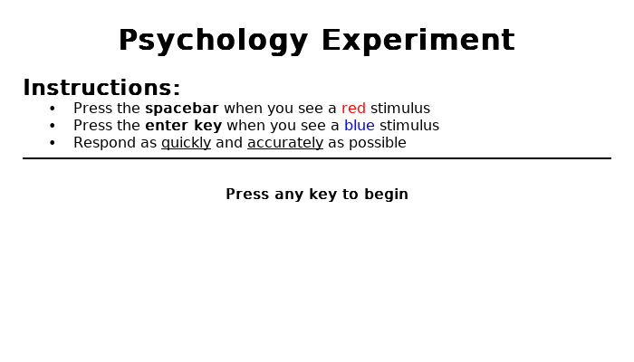

# PEBL HTML-Lite Markup Guide

## Overview

PEBL provides a simple HTML-like markup system for formatting text in Labels and TextBoxes. This markup system allows you to create rich, formatted text without requiring external libraries or complex HTML rendering.

**To enable formatted text mode**, set the `FORMATTED` property to 1:

```pebl
tb <- MakeTextBox("Your <b>formatted</b> text here", font, 400, 300)
SetProperty(tb, "FORMATTED", 1)
```

## Inline Formatting Tags

Inline tags can be used within a line of text to change formatting properties.

### Bold, Italic, and Underline



- `<b>bold text</b>` - Makes text **bold**
- `<i>italic text</i>` - Makes text *italic*
- `<u>underlined text</u>` - Underlines text

**Tags can be combined:**

```pebl
<b><i>bold and italic</i></b>
<b><u>bold and underlined</u></b>
<i><u>italic and underlined</u></i>
<b><i><u>all three together</u></i></b>
```

### Colors



Use the `<c>` tag to change text color:

- `<c=red>red text</c>` - Named colors (supports all 752 X11 color names)
- `<c=#FF0000>hex color</c>` - Hex colors in `#RRGGBB` format
- `<c=#F00>short hex</c>` - Short hex colors in `#RGB` format (automatically expanded)

**Supported color names include:**
- Basic: `red`, `blue`, `green`, `yellow`, `orange`, `purple`, `black`, `white`, `gray`
- Extended: `darkred`, `lightblue`, `forestgreen`, `navy`, `cyan`, `magenta`, `brown`
- ...and 745 more X11 color names

**Examples:**

```pebl
<c=red>This is red</c>
<c=blue>This is blue</c>
<c=#FF6600>This is orange (#FF6600)</c>
<c=darkgreen>This is dark green</c>
```

### Font Sizes

Change font size with the `<size>` tag:

- `<size=12>small text</size>` - 12pt text
- `<size=24>large text</size>` - 24pt text

Sizes can range from 8pt to 200pt.

**Example:**

```pebl
Normal text <size=12>smaller</size> <size=20>bigger</size> <size=24>even bigger!</size>
```

### Line Breaks

Insert a line break with `<br>`:

```pebl
First line<br>
Second line<br>
Third line
```

## Block-Level Tags

Block-level tags affect entire lines or paragraphs. These are primarily used in TextBoxes.

### Headers



Headers (`<h1>` through `<h6>`) create bold text at predefined sizes:

- `<h1>Heading 1</h1>` - 32pt bold
- `<h2>Heading 2</h2>` - 28pt bold
- `<h3>Heading 3</h3>` - 24pt bold
- `<h4>Heading 4</h4>` - 20pt bold
- `<h5>Heading 5</h5>` - 18pt bold
- `<h6>Heading 6</h6>` - 16pt bold

**Headers with justification** (see Text Justification section):

```pebl
<h1=center>Centered Header 1</h1>
<h2=left>Left Header 2</h2>
<h3=right>Right Header 3</h3>
```

### Text Justification



Control text alignment with the `<p>` tag:

- `<p=left>Left-aligned text` - Align text to the left (default)
- `<p=center>Center-aligned text` - Center text horizontally
- `<p=right>Right-aligned text` - Align text to the right

Justification persists until the next newline, then resets to default (left).

**Example:**

```pebl
<p=left>This paragraph is left-aligned.
<p=center>This paragraph is centered.
<p=right>This paragraph is right-aligned.
```

**Combining justification with formatting:**

```pebl
<p=center><b>Bold Centered Text</b>
<p=right><i>Italic Right-Aligned Text</i>
<p=center><c=red><u>Red Underlined Centered Text</u></c>
```

### Horizontal Rules



Insert a horizontal line with `<hr>`:

```pebl
Section 1
<hr>
Section 2
<hr>
Section 3
```

### Bullet Lists



Create bulleted lists with the `<li>` tag:

```pebl
<li>First item
<li>Second item
<li>Third item
```

Each `<li>` tag automatically:
- Starts on a new line
- Adds a bullet point (•)
- Indents the text

**Bullets can contain formatting:**

```pebl
<li><b>Bold</b> bullet point
<li><i>Italic</i> bullet point
<li><c=blue>Blue</c> bullet point
```

### Indentation

Control horizontal positioning with the `<indent>` tag:

- `<indent>` - Indent by 4 character widths (default)
- `<indent=8>` - Indent by 8 character widths
- `<indent=N>` - Indent by N character widths

Indent acts like a tab stop, positioning text at an absolute horizontal position.

**Example - Creating columns:**

```pebl
Name<indent=15>Age<indent=25>City
Alice<indent=15>25<indent=25>Boston
Bob<indent=15>30<indent=25>Chicago
```

## Combining Tags

Tags can be freely combined to create rich formatting:

```pebl
<h2=center><c=blue>Blue Centered Header</c></h2>

<p=center><b><u>Important Notice</u></b></p>

<li><b>Step 1:</b> <c=red>Read carefully</c>
<li><b>Step 2:</b> <c=green>Proceed when ready</c>
```

## Practical Example



Here's a complete example showing an instruction screen for a psychology experiment:

```pebl
define ShowInstructions()
{
    gWin <- MakeWindow("white")
    font <- MakeFont("DejaVuSans.ttf", 0, 14, MakeColor("black"), MakeColor("white"), 0)

    text <- "<h1=center>Psychology Experiment</h1>" + CR(1) + CR(1) +
            "<h3>Instructions:</h3>" + CR(1) +
            "<li>Press the <b>spacebar</b> when you see a <c=red>red</c> stimulus" +
            "<li>Press the <b>enter key</b> when you see a <c=blue>blue</c> stimulus" +
            "<li>Respond as <u>quickly</u> and <u>accurately</u> as possible" + CR(1) +
            "<hr>" + CR(1) +
            "<p=center><b>Press any key to begin</b>"

    tb <- MakeTextBox(text, font, 650, 350)
    SetProperty(tb, "FORMATTED", 1)
    AddObject(tb, gWin)
    Move(tb, 400, 300)
    Draw()

    WaitForAnyKeyPress()
}
```

## Quick Reference Table

| Tag | Description | Example |
|-----|-------------|---------|
| `<b>...</b>` | Bold text | `<b>bold</b>` |
| `<i>...</i>` | Italic text | `<i>italic</i>` |
| `<u>...</u>` | Underlined text | `<u>underline</u>` |
| `<c=color>...</c>` | Colored text | `<c=red>red text</c>` |
| `<size=N>...</size>` | Sized text | `<size=20>big</size>` |
| `<h1>...</h1>` through `<h6>...</h6>` | Headers (bold, sized) | `<h1>Title</h1>` |
| `<h1=just>...</h1>` | Header with justification | `<h1=center>Title</h1>` |
| `<p=just>` | Paragraph justification | `<p=center>centered` |
| `<br>` | Line break | `Line 1<br>Line 2` |
| `<hr>` | Horizontal rule | `<hr>` |
| `<li>` | Bullet list item | `<li>Item 1` |
| `<indent>` or `<indent=N>` | Indentation | `<indent=8>indented` |

**Justification values:** `left`, `center`, `right`

## Technical Notes

### Scope and Persistence

- **Inline formatting** (`<b>`, `<i>`, `<u>`, `<c>`, `<size>`): Requires closing tags, applies only to enclosed text
- **Justification** (`<p=...>`): Applies to current line, resets after newline
- **Indentation** (`<indent>`): Applies to current line, resets after newline

### Tag Nesting

Tags can be nested, but note that PEBL's parser is simple and non-validating:

**Good nesting:**
```pebl
<b><i>bold italic</i></b>
<c=red><b>red bold</b></c>
```

**Avoid improper nesting:**
```pebl
<b><i>text</b></i>  <!-- Not recommended -->
```

### Performance

Formatted text uses more memory and rendering time than plain text. For very long documents (>10,000 characters), consider:
- Breaking text into multiple TextBoxes
- Using plain text where formatting isn't needed
- Pre-computing layouts when possible

### Labels vs TextBoxes

- **Labels**: Support all inline formatting tags (`<b>`, `<i>`, `<u>`, `<c>`, `<size>`, `<h1>`-`<h6>`, `<br>`)
- **TextBoxes**: Support all tags including block-level formatting (`<hr>`, `<li>`, `<indent>`, `<p>`)

For single-line or simple formatted text, use Labels. For complex multi-line formatted text with justification, bullets, or indentation, use TextBoxes.

## Example Templates

### Survey Question

```pebl
text <- "<h3>Question 1:</h3>" + CR(1) +
        "How satisfied are you with the experiment?" + CR(1) + CR(1) +
        "<li>Very Satisfied" +
        "<li>Satisfied" +
        "<li>Neutral" +
        "<li>Dissatisfied" +
        "<li>Very Dissatisfied"
```

### Results Screen

```pebl
text <- "<h1=center>Experiment Complete!</h1>" + CR(1) + CR(1) +
        "<hr>" + CR(1) +
        "<h3>Your Results:</h3>" + CR(1) +
        "<indent>Accuracy:<indent=20>" + ToString(accuracy) + "%" + CR(1) +
        "<indent>Reaction Time:<indent=20>" + ToString(rt) + " ms" + CR(1) +
        "<hr>" + CR(1) +
        "<p=center><c=green><b>Thank you for participating!</b></c>"
```

### Warning Message

```pebl
text <- "<p=center><c=red><h2>⚠ WARNING ⚠</h2></c>" + CR(1) + CR(1) +
        "<p=center>This experiment contains <b>flashing lights</b>." + CR(1) +
        "<p=center>Not suitable for individuals with photosensitive epilepsy." + CR(1) + CR(1) +
        "<hr>" + CR(1) +
        "<p=center>Press <b>Q</b> to quit or <b>C</b> to continue"
```

## Additional Resources

- **Color Names**: See [X11 Color Names](https://en.wikipedia.org/wiki/X11_color_names) for the full list of 752 supported colors
- **PEBL Manual**: Section on TextBox and Label objects
- **Test File**: See `test-htmllite-markup.pbl` in the PEBL installation for a comprehensive test of all features

---

*Last Updated: January 2026*
*PEBL Version: 2.3+*
*Feature: HTML-Lite Markup System*
