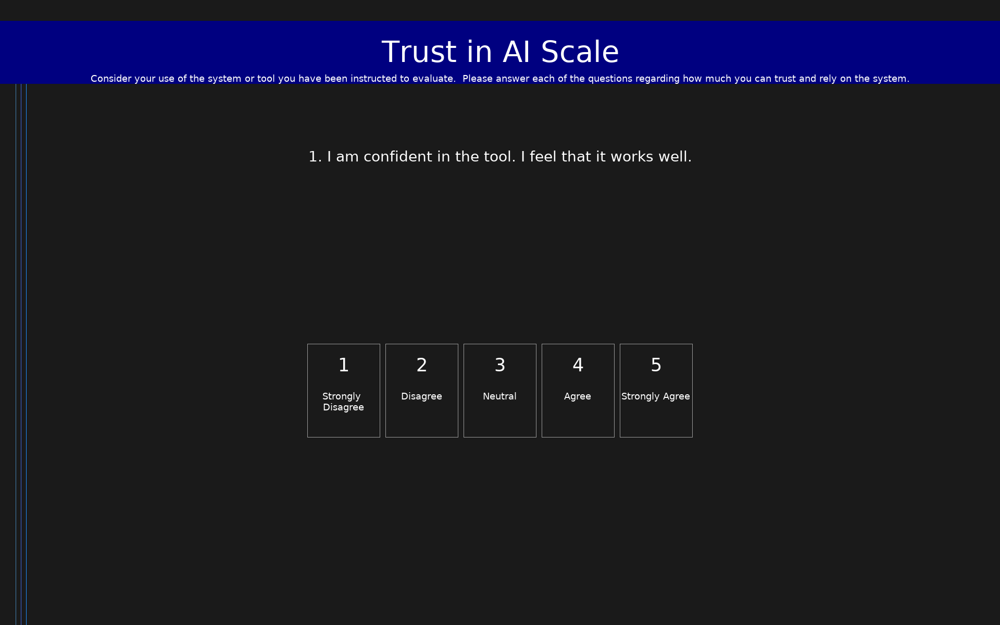

# Trust in AI Scale

**Abbreviation:** Trust in the AI/XAI Context  
**Code:** `AITrust`  
**Version:** 1.0  
**License:** CC  

8-item scale measuring user assessments of trust in AI systems, with reverse-coded wary item.

## Scale Summary

- **Items:** 0
- **Dimensions:** 1
  - **Trust in AI (TRUSTAI):** Mean trust in AI score, with appropriate reverse coding of negatively-posed questions.

## Scoring

- **Trust_In_AI**: mean_coded (8 items)

## Citation

> Hoffman, R. R., Mueller, S. T., Klein, G., & Litman, J. (2023). Measures for explainable AI: Explanation goodness, user satisfaction, mental models, curiosity, trust, and human-AI performance. Frontiers in Computer Science, 5, 1096257.

## Links

- [https://www.frontiersin.org/journals/computer-science/articles/10.3389/fcomp.2023.1096257/full](https://www.frontiersin.org/journals/computer-science/articles/10.3389/fcomp.2023.1096257/full)

## Files

- `AITrust.osd` - Scale definition (OpenScales OSD format)
- `AITrust.pbl.png` - Preview screenshot

## Usage

This scale is designed to be run using the PEBL ScaleRunner system.
See the [PEBL documentation](https://pebl.sf.net) for details.
