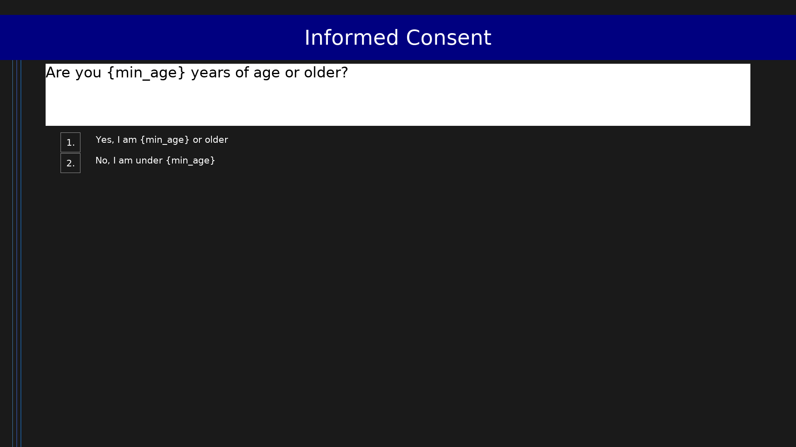

# Informed Consent

**Abbreviation:** Consent  
**Code:** `Consent`  
**Version:** 1.0  

Generic IRB-style informed consent gate. Customise study_title, pi_name, and contact_email via parameters. Terminates and records a data row if the participant declines or is ineligible.

## Scale Summary

- **Items:** 0

## Files

- `Consent.osd` - Scale definition (OpenScales OSD format)
- `Consent.pbl.png` - Preview screenshot

## Usage

This scale is designed to be run using the PEBL ScaleRunner system.
See the [PEBL documentation](https://pebl.sf.net) for details.
