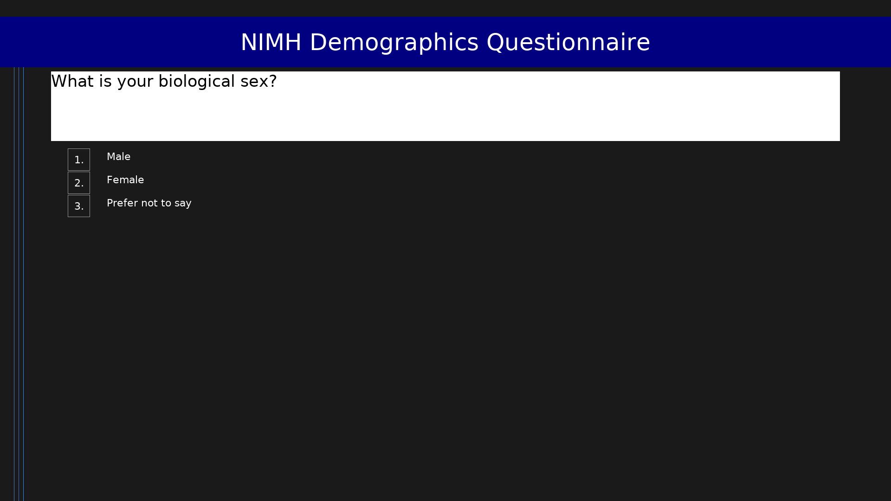

# NIMH Demographics Questionnaire

**Abbreviation:** DEMO-NIMH  
**Code:** `DEMO-NIMH`  
**Version:** 1.0  
**License:** Public Domain  

Standard NIMH demographic questions covering biological sex, gender identity, Hispanic/Latino heritage, race/ethnicity (multi-select), and age. Based on the PEBL GetNIMHDemographics() function with updated sex/gender items per current NIH guidelines.

## Scale Summary

- **Items:** 0

## Citation

> Adapted from NIH/NIMH demographic reporting requirements. See NOT-OD-15-089 for NIH inclusion reporting guidelines.

## Links

- [https://grants.nih.gov/grants/guide/notice-files/NOT-OD-15-089.html](https://grants.nih.gov/grants/guide/notice-files/NOT-OD-15-089.html)

## Files

- `DEMO-NIMH.osd` - Scale definition (OpenScales OSD format)
- `DEMO-NIMH.pbl.png` - Preview screenshot

## Usage

This scale is designed to be run using the PEBL ScaleRunner system.
See the [PEBL documentation](https://pebl.sf.net) for details.
